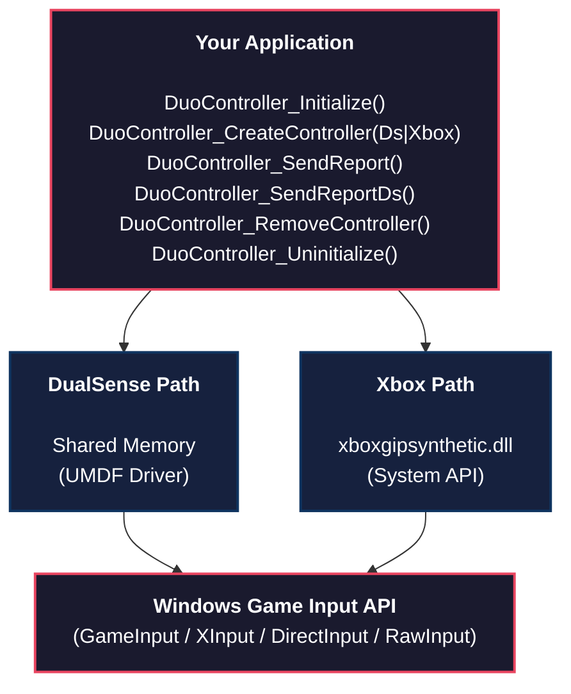

<p align="center">
  
  
  
  
</p>

## Overview

**DuoController** is a pure userspace virtual gamepad library and UMDF driver for Windows that emulates **DualSense Edge** and **Xbox One** controllers entirely from user mode.

It is a spiritual successor to [ViGEmBus](https://github.com/ViGEm/ViGEmBus), the now-abandoned KMDF-based kernel driver, reimagined using Microsoft's **User-Mode Driver Framework (UMDF)**.

## Why Userspace?

Microsoft is actively steering the Windows driver ecosystem away from kernel-mode and toward user-mode drivers.

The reasoning is clear:

| Concern | Kernel Driver (KMDF) | User Driver (UMDF) |
|---|---|---|
| **System Stability** | A crash takes down the entire OS | A crash takes down only the driver process |
| **Attestation Signing** | Required (EV certificate, expensive) | **Not required** |
| **Development Complexity** | High - kernel debugging, WinDbg, VM setup | Low - standard user-mode tooling |
| **Security Surface** | Ring 0 - full system access | Ring 3 - sandboxed, limited privileges |
| **Distribution** | Signing portal, HLK testing | Standard DLL deployment |

### The Signing Problem

Kernel drivers on modern Windows **must** be submitted to the Windows Hardware Dev Center, pass through attestation signing, and have to be pre-signed by an Extended Validation (EV) code signing certificate.

This process costs hundreds of dollars, requires a registered legal entity that fulfills Microsoft's requirements, and takes weeks of turnaround.

UMDF drivers require **no such signing**. A standard code signing certificate (or even self-signing for development or small-scale publishing) is sufficient.

This makes DuoController dramatically more accessible to:

- **Independent developers**
- **Small teams**

## Features

- **DualSense Edge Emulation** - Via HID minidriver
- **Xbox One Emulation** - Via `xboxgipsynthetic.dll`
- **Touchpad Support** - Dual-touch finger tracking with full 1920×943 resolution for DualSense Edge
- **IMU Support** - Full gyroscope/accelerometer support for DualSense Edge
- **Edge Button Mapping** - Mic mute and left/right paddle/function buttons for DualSense Edge
- **Battery Reporting** - Discharging/charging/full detection with 0-100% granularity for DualSense Edge
- **Microphone & Headset Detect** - External mic, headphones, and USB audio status for DualSense Edge
- **Force Feedback** - Full force feedback callback support for both controller types
- **Session Isolation** - Isolates gamepads to the current session ID for multi-session and RDP environments
- **Minimal Footprint** - A single DLL/INF pair, no kernel components

## Architecture



## API

```c
// Initialize the library
HRESULT DuoController_Initialize();

// Create a virtual controller
HRESULT DuoController_CreateController(
    DUO_CONTROLLER_TYPE controllerType,    // DuoControllerTypeXbox or DuoControllerTypeDs
    DuoController_VibrationReportCallback_t vibrationCallback,
    void* vibrationCallbackContext,
    void** controller
);

// Send Xbox One input report
HRESULT DuoController_SendReport(
    void* controller,
    DUO_CONTROLLER_INPUT_REPORT* inputReport
);

// Send DualSense Edge input report
HRESULT DuoController_SendReportDs(
    void* controller,
    DUO_CONTROLLER_INPUT_REPORT_DS* inputReport
);

// Remove a virtual controller
HRESULT DuoController_RemoveController(void* controller);

// Uninitialize the library
HRESULT DuoController_Uninitialize();
```

## Getting Started

### Prerequisites

- Windows 10 or later (x64)
- Visual Studio 2026
- Windows Driver Kit (WDK, Nu-Get preferred)

### Build

```powershell
# Open DuoController.sln in Visual Studio and build for Release x64
```

## Projects

| Project | Description |
|---|---|
| `DuoController` | The UMDF driver DLL and library — implements the HID minidriver, shared memory server, and client API for DualSense Edge and Xbox |

## License

Apache 2.0 © 2026 Black-Seraph
